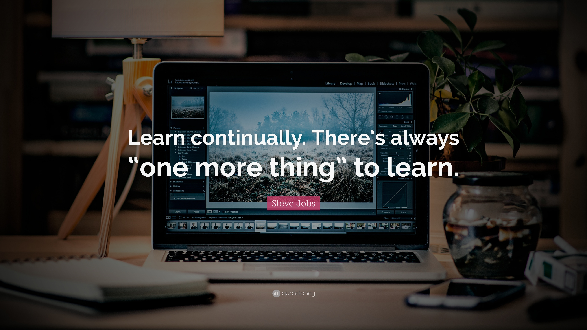

<!--
Hello, my name is Vikash Kumare Gupta.
-->

 
---
##  My name is Vikash Kumar Gupta 

      

### 👨‍💻 A new Journey - From Learner to Full Stack Developer 🧐 🔎

📖 I'm a passionate self-taught Full Stack Web Developer with a love for bringing ideas to life through elegant, user-friendly interfaces 🤕 my passion for software lies with dreaming up ideas and making them come true with elegant interfaces 🤓 i take great care in the experience, architecture, and code quality of the things I build 💻

📖 i am also an open-source enthusiast and maintainer 😕 i learned a lot from the open-source community and i love how collaboration and knowledge sharing happened through open-source 🌍

📖 __Self-learning__ is one of the most important and enjoyable parts of my life ☺️ I soon found out that GitHub is such a good place for me to record my never-ending learning journey🔥 To me, it is my open learning journal where I can not only keep my notes and references while learning new technical stuff but also share them with others who may find them helpful 📔

📖 To be continued...

    

  
🍀🍀🍀

## 🛠 Languages and Tools

📖 I have been learning and exploring these following tools and languages

<picture>
  <source media="(prefers-color-scheme: dark)" srcset="https://github.com/Kiran1689/kiran1689/blob/main/Skills_Animation_Dark.gif?raw=true">
  <source media="(prefers-color-scheme: light)" srcset="https://github.com/Kiran1689/kiran1689/blob/main/Skills_Animation_White.gif?raw=true">
   
</picture>
  

                             

## 🚀 Featured Projects

<table>
<tr>
<td width="50%" valign="top">

### 🤖 AI-Powered Code Reviewer
> **Full Stack AI Code Analysis Platform**

- 🧠 Integrated **Gemini 2.0 Flash API** for intelligent code reviews
- ⚡ Supports **JavaScript, Python, Java, and C++** code analysis
- 🔒 User authentication with secure session management
- 🌐 Built with **MERN Stack** and deployed on Render

`React.js` `Node.js` `Express.js` `MongoDB` `Gemini AI` `Tailwind CSS`

</td>
<td width="50%" valign="top">

### 🏥 HealthSync Event-Driven Azure
> **Cloud-Native Hospital Management System**

- ☁️ Built using **ASP.NET Core** and Microsoft Azure services
- 📧 Automated appointment workflows using **Service Bus & Logic Apps**
- 📄 Secure medical report storage with **Azure Blob Storage**
- 🔐 Enterprise-grade architecture with **API Management & Key Vault**

`C#` `ASP.NET Core` `Azure` `Service Bus` `Logic Apps` `SQL Database`

</td>
</tr>

<tr>
<td width="50%" valign="top">

### 🗳️ Secure E-Voting Validation System
> **Merkle Tree Based Voter Verification**

- 🌳 Implemented **Merkle Trees** for tamper detection
- 🔐 Secure voter validation using **FNV-1a hashing**
- 📊 Processes datasets containing **7000+ voter records**
- ⚡ Efficient verification with modular C++ architecture

`C++` `Merkle Tree` `FNV-1a Hashing` `STL` `CSV Processing`

</td>
<td width="50%" valign="top">

### 🚀 NovaCore AI Assistant
> **Next-Generation Intelligent Virtual Assistant**

- 🎤 Voice-controlled assistant with NLP capabilities
- 💻 PC automation, system control, and web navigation
- 🖼️ AI image generation and computer vision integration
- 📱 WhatsApp automation, reminders, and weather updates

`Python` `Speech Recognition` `NLP` `Automation` `Computer Vision`

</td>
</tr>

<tr>
<td width="50%" valign="top">

### 📄 AI-Powered Resume Analyzer
> **ATS Resume Evaluation Platform**

- 📊 Generates ATS Match Scores against job descriptions
- 🔍 Extracts skills using OCR and NLP techniques
- 💡 Suggests missing skills and role recommendations
- 📈 Interactive Gradio dashboard with visual analytics

`Python` `Gradio` `NLTK` `Tesseract OCR` `Matplotlib`

</td>
<td width="50%" valign="top">

### 💬 Chatverse App
> **Real-Time Cross Platform Chat Application**

- ⚡ Real-time messaging powered by **Socket.IO**
- 🔐 JWT authentication and secure user management
- 📱 Cross-platform mobile app built using Flutter
- 💬 Typing indicators and live chat functionality

`Flutter` `Node.js` `Express.js` `MongoDB` `Socket.IO` `JWT`

</td>
</tr>
</table>

---

## 📊 Stats

  

<!-- GitHub Activity Graph -->

## 🏆 GitHub Trophies

  

---
## 🐍 Contribution Snake

---

  

<h2 align="center">
💬 Let's Connect & Build Something Awesome! 🚀
</h2>

